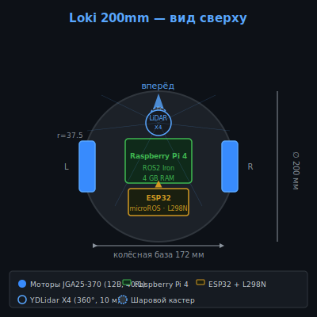
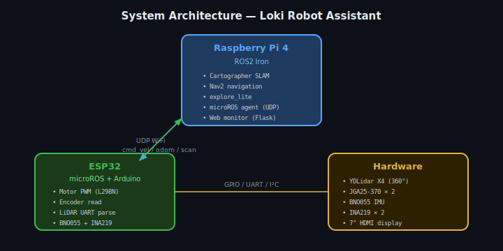
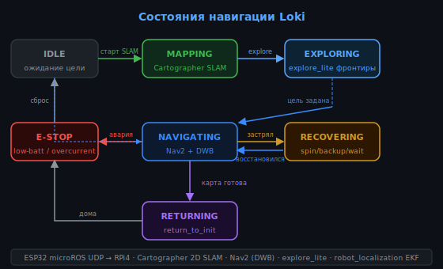

<div align="center">

**English** • [Русский](README.md)

</div>

<div align="center">

# 🤖 Loki Robot Assistant

**Autonomous home robot assistant based on MakersPet Loki 200mm**
ESP32 + microROS · Raspberry Pi 4 · ROS2 Iron · Cartographer SLAM · Nav2

[](LICENSE.md)
[](https://docs.ros.org/en/iron/)
[](https://platformio.org/)
[](https://www.raspberrypi.com/)
[](https://github.com/kaiaai/LDS)

</div>

---

## About

Loki Robot Assistant is an autonomous mobile robot built on the **MakersPet Loki 200mm** platform.
Differential drive with caster wheel, 360° LiDAR scanning, full ROS2 Iron stack.

- **ESP32** controls motors, sensors, and LiDAR — publishes data over UDP via **microROS**
- **Raspberry Pi 4** runs **ROS2 Iron**: Cartographer SLAM, Nav2 navigation, autonomous frontier exploration
- Fully 3D-printable chassis, open hardware and software

---

## Photos

<div align="center">


*MakersPet Loki 200mm — robot platform*

</div>

| Top View | System Architecture |
|:-:|:-:|
|  |  |

---

## Video & Demo

| Platform Assembly | PC & Firmware Setup | First Bringup | ESP32 LiDAR |
|:-:|:-:|:-:|:-:|
| [](https://www.youtube.com/watch?v=WPB2B1DPf_s) | [](https://www.youtube.com/watch?v=XOc5kCE3MC0) | [](https://www.youtube.com/watch?v=L_XbkA4pwRc) | [](https://www.youtube.com/watch?v=zizGI8MjANU) |

---

## Hardware BOM

| Component | Qty | Price | Source |
|-----------|-----|-------|--------|
| Raspberry Pi 4 (4GB) | 1 | $55 | [raspberrypi.com](https://www.raspberrypi.com/) |
| ESP32 DevKit v1 | 1 | $4.50 | AliExpress |
| MakersPet Loki 200mm frame | 1 | $45 | [makerspet.com](https://makerspet.com/store) |
| JGA25-370 DC gear motor 12V 40:1 | 2 | $7 × 2 | AliExpress |
| Omni wheel 48mm | 2 | $3.50 × 2 | AliExpress |
| Caster ball 15mm | 1 | $2 | AliExpress |
| L298N motor driver | 1 | $2.50 | AliExpress |
| **YDLidar X4** (360°, 10m) | 1 | $55 | [Amazon](https://www.amazon.com/s?k=ydlidar+x4) |
| BNO055 IMU (9-DOF) | 1 | $3.50 | AliExpress |
| INA219 current sensor | 2 | $1.20 × 2 | AliExpress |
| LiPo 11.1V 3S 3000mAh | 1 | $18 | RC shop |
| 7" HDMI display | 1 | $35 | AliExpress |
| USB wide-angle camera | 1 | $12 | AliExpress |
| Hardware (bolts, wires) | — | $8 | Local |
| **Total** | | **~$264** | |

> LiDAR can be replaced with **Xiaomi LDS02RR** (~$15 used) or **RPLIDAR A1** (~$99).
> All models supported by [kaiaai/LDS](https://github.com/kaiaai/LDS) with no ROS2 code changes.

Full BOM: [cad/bom.csv](cad/bom.csv)

---

## System Architecture


### ESP32 Firmware Stack

```
firmware/
├── config.h                  # Pin definitions and platform constants
├── platformio.ini            # micro_ros_kaia · kaiaai/LDS · PID_Timed
└── src/
    ├── main.ino              # Main loop: 50Hz control cycle
    ├── motor_driver.*        # L298N PWM control (coast / brake modes)
    ├── encoder.*             # Quadrature encoder (IRAM ISR)
    ├── odometry.*            # Differential drive odometry (1920 ticks/rev)
    ├── pid.*                 # PID with integral anti-windup
    ├── lidar_driver.*        # kaiaai/LDS wrapper (YDLidar X4 / LDS02RR …)
    ├── imu.*                 # BNO055 — NDOF fusion mode
    ├── current_sensor.*      # INA219 — motor current monitoring
    ├── safety.*              # E-stop / low-batt / overcurrent watchdog
    ├── battery_monitor.*     # LiPo 3S percentage via ADC
    ├── wifi_config.h         # WiFi SSID/PASS + OTA password
    └── microros_bridge.*     # microROS: /odom · /scan · /imu/data ← /cmd_vel
```

### ROS2 Stack (Raspberry Pi 4)

```
ros2/
├── CMakeLists.txt · package.xml
├── config/
│   ├── cartographer_lds_2d.lua   # Cartographer: 0.15–7m range
│   ├── navigation.yaml            # Nav2 DWB + 3×3m local costmap
│   ├── explore_lite.yaml          # Autonomous frontier exploration
│   ├── ekf.yaml                   # EKF: odom + IMU fusion
│   └── telem.yaml
├── launch/
│   ├── loki_bringup.launch.py    # Full stack launch
│   ├── slam.launch.py
│   └── explore.launch.py
├── urdf/robot.urdf.xacro          # Loki 200mm kinematic model
└── rviz/navigation.rviz
```

---

## Supported LiDARs

The [kaiaai/LDS](https://github.com/kaiaai/LDS) library supports **20+ models** with no code changes:

| Model | Range | Price | Status |
|-------|-------|-------|--------|
| **YDLidar X4** | 10m | ~$60 | ✅ Recommended |
| RPLIDAR A1 | 12m | ~$99 | Best quality |
| Xiaomi LDS02RR | 6m | ~$15 (used) | Most affordable |
| Neato XV11 | 6m | ~$20 (used) | |
| YDLidar X3 | 8m | ~$40 | Budget |
| LDROBOT LD14P | 8m | ~$40 | |

Full table: [docs/lidar_compatibility.md](docs/lidar_compatibility.md)

---

## Navigation State Machine



---

## Quick Start

### 1. Flash ESP32
```bash
cd firmware && pio run --target upload --environment esp32dev
```

### 2. Setup Raspberry Pi 4
```bash
sudo apt install -y ros-iron-desktop ros-iron-nav2-bringup \
    ros-iron-cartographer-ros ros-iron-explore-lite \
    ros-iron-micro-ros-agent ros-iron-robot-localization
mkdir -p ~/ros2_ws/src && cd ~/ros2_ws/src
git clone https://github.com/Mukller/omni-robot-assistant.git
cp -r omni-robot-assistant/ros2 loki_robot
cd ~/ros2_ws && colcon build && source install/setup.bash
```

### 3. Launch
```bash
ros2 launch loki_robot loki_bringup.launch.py
```

---

## Documentation

| Document | Description |
|----------|-------------|
| [docs/wiring.md](docs/wiring.md) | Full wiring guide |
| [docs/assembly.md](docs/assembly.md) | Assembly with print settings |
| [docs/calibration.md](docs/calibration.md) | Encoder, IMU, PID calibration |
| [docs/ros2_setup.md](docs/ros2_setup.md) | ROS2 Iron installation on RPi 4 |
| [docs/ros2_architecture.md](docs/ros2_architecture.md) | Node topology, topics, TF tree |
| [docs/lidar_compatibility.md](docs/lidar_compatibility.md) | Compatible LiDAR table (20+ models) |
| [docs/stl_files.md](docs/stl_files.md) | STL list with print settings |
| [docs/hardware/ydlidar_x4.md](docs/hardware/ydlidar_x4.md) | YDLidar X4 specs & wiring |
| [docs/hardware/motors_and_wheels.md](docs/hardware/motors_and_wheels.md) | Motors, wheels, L298N |
| [docs/hardware/sensors.md](docs/hardware/sensors.md) | BNO055, INA219, battery |
| [docs/hardware/raspberry_pi.md](docs/hardware/raspberry_pi.md) | RPi 4 setup + systemd autostart |

---

## References

- [MakersPet Loki 200mm](https://github.com/makerspet/makerspet_loki) — platform, STL, schematics
- [MakersPet 3D Models](https://github.com/makerspet/3d_models/tree/main/loki_200mm) — all LiDAR mount plates
- [kaiaai/LDS](https://github.com/kaiaai/LDS) — Arduino LiDAR library (20+ models)
- [micro-ROS Arduino](https://github.com/micro-ROS/micro_ros_arduino) — microROS for ESP32
- [Cartographer ROS](https://google-cartographer-ros.readthedocs.io/) — SLAM docs
- [Nav2](https://navigation.ros.org/) — ROS2 navigation stack
- [Awesome 2D LiDARs](https://github.com/kaiaai/awesome-2d-lidars) — 2D LiDAR catalog
- [MakersPet PCB](https://github.com/makerspet/pcb) — KiCad schematics and PCBs
- [Braccio MoveIt Gazebo](https://github.com/lots-of-things/braccio_moveit_gazebo) — Braccio arm (future expansion)
